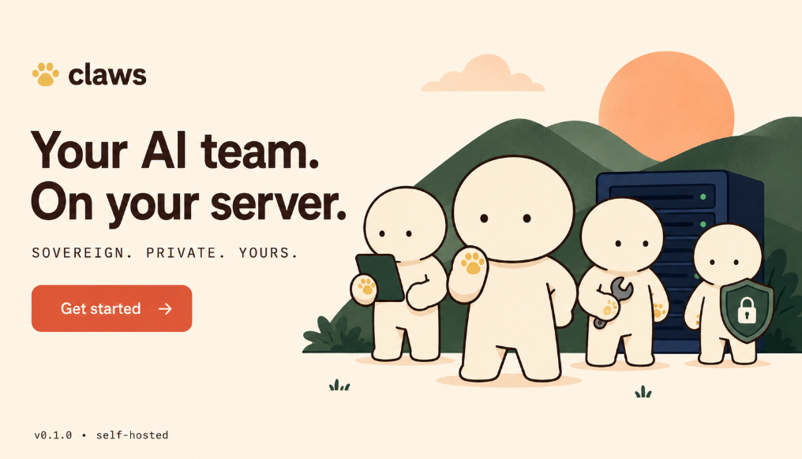

<p align="center">
  
</p>

<h1 align="center">claws</h1>

<p align="center"><em>a small team of agents, on your own server</em></p>

<p align="center">
  <a href="LICENSE"></a>
  <a href="https://github.com/ab0t-com/claws/releases"></a>
  <a href="#install"></a>
</p>

---

**claws is a manager for a team of AI agents.** A single Go binary that creates, runs, updates, and monitors a fleet of agents on your own server — each with its own identity, credentials, channel (Telegram, WhatsApp, Discord, Slack), and workspace. One CLI, a team of agents, one box.

## Why claws

- **It manages a team, not one bot.** Create, start, stop, upgrade, monitor — every agent in your fleet from one CLI. Each agent is a persistent persona: its own role, its own credentials, its own name. You message *sarah*; *sarah* remembers.
- **One-click install.** `claws setup` walks you from blank box to first running agent — docker prereqs, OAuth, channel connect, all wizards. A second command (`claws update`) keeps the CLI itself current.
- **Fleet-wide operations.** `claws start team` brings up a whole team. `claws auth fleet codex` re-auths every agent independently. `claws upgrade --all` rolls the runtime image with auto-rollback on health-check failure.
- **Honest diagnostics.** `claws agent ping` and `claws auth diagnose` answer *"is my agent actually working?"* in seconds, with the exact fix command if it isn't.

## See it work

```
$ claws list
NAME               PORT     STATUS       RAM        UPTIME     NEXT
────────────────── ──────── ──────────── ────────── ────────── ────
team1/ben          :18989   healthy      130.2MiB   10 hours   claws agent ping team1/ben
team/sarah         :18789   created      —          —          claws start team/sarah
team/john          :18889   created      —          —          claws start team/john

Next:
  3 agent(s) never started                                claws start-all
  verify team1/ben end-to-end                             claws agent ping team1/ben
  tail every running agent's logs in one stream           claws fleet logs -f
```

Every command tells you what to run next. If something's broken, the error tells you the fix.

```
$ claws agent ping team/sarah

  ✓ gateway:   container reports healthy on :18789
  ✓ readyz:    /readyz 200 — agent ready to receive
  ✓ auth:      verified via logs strategy
  ✓ channels:  2 configured: telegram, whatsapp

✓ team/sarah looks healthy
```

## 60-second start

```bash
# 1. Install claws (pinned release, checksum-verified)
curl -fsSL https://raw.githubusercontent.com/ab0t-com/claws/main/scripts/install.sh | bash

# 2. Run the guided wizard
claws setup
```

That's it. The wizard:

- Checks for **docker** and offers the one-liner to install it if missing
- **Detects credentials you might already have** (`$OPENAI_API_KEY` / `$ANTHROPIC_API_KEY` in env, `~/.codex`, `~/.claude`, existing claws agents)
- **Creates your first team + agent**
- Walks you through **Codex OAuth or API key** setup
- **Connects a messaging channel** (Telegram / Discord / Slack / WhatsApp)

If you'd rather not paste a 46-character bot token into SSH, `claws paste-secret` opens a phone-friendly local form so you can paste from your phone instead.

## Common commands

```bash
claws list                    # every agent + what to do next, per row
claws agent ping team/sarah   # is this agent actually responding end-to-end?
claws start team              # fan out: start every agent in a team
claws auth fleet codex        # re-auth every agent independently (avoids OAuth collisions)
claws auth diagnose           # find broken model auth across the fleet
claws dashboard               # live status of every agent
claws update                  # update the claws binary itself
claws upgrade --all           # roll every agent to a new runtime image
```

Run `claws help` for the full reference, or `claws <command> --help` for any command.

## What you actually do with it

- **Personal AI team.** A coordinator + worker setup — one agent receives a task on Telegram, delegates to a worker, relays the answer back.
- **Always-on Telegram / Discord bots** that survive reboots. Run for the cost of a small VPS plus your model usage.
- **Multiple agents, one model account.** Run *sarah*, *john*, *lead*, and *ben* from the same Codex subscription — each in its own container, each with its own persona, each with its own credentials so they don't fight over refresh tokens.
- **Bring your own server, bring your own model credentials.** Pay your model provider for inference; pay nobody else.

## Worked examples

### Bring up a Telegram bot in 5 minutes

```bash
# On a fresh box
curl -fsSL https://raw.githubusercontent.com/ab0t-com/claws/main/scripts/install.sh | bash
claws setup

# Wizard walks through:
#   step 1: prereq check (offers to install docker if missing)
#   step 2: workspace + security policy
#   step 3: team name (e.g. "personal")
#   step 4: first agent name (e.g. "sarah")
#   step 5: auth — pick from detected $OPENAI_API_KEY, Codex OAuth, or paste API key
#   step 6: channel — Telegram, paste BotFather token (or use claws paste-secret from phone)

# When it's done:
claws list                          # personal/sarah :18789 healthy
claws agent ping personal/sarah     # ✓ gateway ✓ readyz ✓ auth ✓ channels

# DM your bot on Telegram, get a reply.
```

### Stand up a coordinator + worker team

```bash
# A team where one agent receives requests + delegates to workers
claws create research/lead --role=manager
claws create research/dev1 --role=worker --manager=lead
claws create research/dev2 --role=worker --manager=lead

claws auth fleet codex              # OAuth for each (independent grants → no token-reuse collisions)
claws channel add research/lead telegram --token=<lead's bot token>
claws start research                # fan out: start every agent in the team

# In Telegram, message the lead bot:
#   "Find the latest paper on attention sparsity and summarise"
# The lead delegates to dev1 (or dev2), relays the answer back to you.
```

### Update the whole fleet

```bash
claws update                        # update the claws CLI binary itself
claws update --check                # just report what's available; don't install

claws upgrade --all --image=openclaw:v2026.6.1
                                    # roll every agent to the new runtime image
                                    # auto-rollback if health check fails within 30s
```

`claws update` updates the **CLI**. `claws upgrade` updates **agent containers**. Two different concerns, two different commands.

### Diagnose a misbehaving agent

```bash
claws list                          # what state is the fleet in?
claws agent ping team/john          # one-screen diagnostic: gateway / readyz / auth / channels
claws auth diagnose                 # fleet-wide auth state, risk heuristics fire automatically
claws logs team/john --grep=401     # filter logs for auth failures

# Common patterns:
#   "refresh_token_reused"   → shared OAuth → claws auth fleet codex (re-auth independently)
#   "port already allocated" → orphan container → claws orphans clean
#   "401 from WhatsApp"      → session expired → claws exec <name> channels login --channel whatsapp
```

`claws agent ping` shows you the exact fix command for each failing check.

### Re-auth without breaking anything

```bash
# OAuth refresh tokens are single-use. If multiple agents share the same upstream account,
# one wins each refresh and the others get refresh_token_reused → 401 on every model call.

claws auth diagnose                 # check who's broken and why
claws auth team/john codex          # re-auth one agent
claws auth fleet codex --missing-only  # OR re-auth every agent that doesn't verify
                                    # (each gets its own independent OAuth grant)
```

## Skills (for Claude Code users)

If you're using [Claude Code](https://claude.com/claude-code) to work with or operate claws, this repo ships four ready-to-use skills at [`.claude/skills/`](.claude/skills/) that encode the common workflows above. They trigger automatically when you describe a relevant task in plain English.

| Skill | Triggers on phrases like | What it does |
|---|---|---|
| [`claws-bootstrap-fresh-box`](.claude/skills/claws-bootstrap-fresh-box/SKILL.md) | "set up claws on this box", "install claws from scratch", "fresh EC2, get claws running" | Walks from "nothing installed" to "first agent responding on Telegram" — OS + TTY + root detection, prereq install (friendly or audit-managed), claws install, `claws setup`, verify with `claws agent ping`. |
| [`claws-add-agent`](.claude/skills/claws-add-agent/SKILL.md) | "add a new agent", "spin up another bot called X", "add a worker under \<manager\>" | Adds an agent to an already-bootstrapped fleet — `claws create` + per-agent auth (with the no-shared-OAuth rule) + channel wiring + start + end-to-end ping. |
| [`claws-debug-agent`](.claude/skills/claws-debug-agent/SKILL.md) | "my agent isn't responding", "team/sarah stopped working", "refresh_token_reused", "auth keeps failing" | Five-step diagnostic (`list` → `agent ping` → `auth diagnose` → `logs` → `errors`) mapping each symptom to the exact fix command. Covers the v1.6.11–v1.6.15 version-gated bugs that can make the diagnostic itself lie. |
| [`claws-release`](.claude/skills/claws-release/SKILL.md) | "ship a new release", "cut v1.6.X", "release claws", "bump and ship" | Cuts a clean patch release via `publish-release.sh` — enforces patch-only versioning, the `[Unreleased]` discipline, and the v1.6.17+ artifact-before-tag ordering. |

Each skill has explicit "do NOT use this skill for ..." disclaimers pointing at its siblings, so they don't collide. Describe what you want; Claude picks the right one from the trigger phrases.

## Features

| Area | What it does | Try it |
|---|---|---|
| **Setup wizard** | Six guided steps, auto-detects what's already there | `claws setup` |
| **Auth** | Codex OAuth, OpenAI / Anthropic / OpenRouter API keys, per-agent isolated | `claws auth fleet codex` |
| **Channels** | Telegram, WhatsApp, Discord, Slack, Signal | `claws channel add <agent> telegram` |
| **Team coordination** | Manager / worker roles, atomic task queues via filesystem `rename()` | `claws task create team "review PR #42"` |
| **Diagnostics** | One-screen "is this agent OK?" + fleet-wide auth health | `claws agent ping <name>` |
| **Hot upgrades** | Auto-rollback to previous image if health check fails within 30s | `claws upgrade --all --image=openclaw:v2026.4.1` |
| **Backup / restore** | Per-agent, with or without credentials | `claws backup <name>` |
| **S3 storage adapter** | Mount remote storage as a workspace | `claws storage setup --bucket=...` |
| **HTTPS via Caddy** | Per-fleet domain + auto certs | `claws proxy setup --domain=ai.example.com` |
| **Security** | Per-agent access control + audit log | `claws audit` |
| **Group fan-out** | Operate on whole teams at once | `claws start team` |

In-depth guides: [`docs/`](docs/) — channels, runtimes, one-click pathway, brand.

---

## Install

The [60-second start](#60-second-start) above uses the convenience installer. Other options:

```bash
# Pin to a specific version
curl -fsSL https://raw.githubusercontent.com/ab0t-com/claws/main/scripts/install.sh | bash -s -- --version=v1.6.17

# Self-update an existing install
claws update                  # install the latest release
claws update --check          # just report what's available

# Build from source (needs Go 1.22+)
git clone https://github.com/ab0t-com/claws.git && cd claws
./scripts/rebuild.sh
```

The installer verifies the published SHA256 before installing, falls back to `~/.local/bin` if `/usr/local/bin` isn't writable, and keeps the previous binary for one-step rollback.

## Prerequisites

claws shells out to Docker. On a fresh box, you'll need:

| Tool | Required | Why |
|---|---|---|
| **docker** (engine + daemon) | yes | Every agent runs in a container |
| **docker compose** (v2 plugin) | yes | Per-agent compose orchestration |
| **bash + curl** | yes | The installer scripts |
| **git** | optional | Source builds only |

### One command, any OS

```bash
curl -fsSL https://raw.githubusercontent.com/ab0t-com/claws/main/scripts/prereqs/install-all.sh | bash
```

Auto-detects Ubuntu / Debian / Fedora / RHEL / Arch / Alpine / macOS. Idempotent — re-running skips anything already installed.

If you're on a **fresh EC2 root box, cloud-init, or an agent automation context** (no TTY for prompts):

```bash
curl -fsSL https://raw.githubusercontent.com/ab0t-com/claws/main/scripts/prereqs/install-all.sh | bash -s -- --yes
```

For **corporate / audit-managed hosts** — `--audit` mode prints every command without executing it, `--no-group` skips adding `$USER` to the docker group, `CLAWS_NO_INSTALL=1` is a policy opt-out:

```bash
curl -fsSL https://raw.githubusercontent.com/ab0t-com/claws/main/scripts/prereqs-strict/install-all.sh | bash -s -- --audit
```

Per-tool installs, supported OSes, failure modes, reuse-in-other-tools: [`scripts/prereqs/README.md`](scripts/prereqs/README.md).

> If you skip this and run `claws create foo` without docker, claws prints the exact install command for you — no detective work required.

---

## Configuration

Instances are configured via layered JSON merge:

1. **Global defaults** — `~/.openclaw/defaults.json`
2. **Group defaults** — `~/.openclaw/<group>/defaults.json`
3. **Template** — `--from=<instance>` copies another instance's config
4. **Instance skeleton** — port, token, auth (always wins)

### Environment variables

| Variable | Default | Description |
|---|---|---|
| `OPENCLAW_ROOT` | `~/.openclaw` | Root directory for all instances |
| `OPENCLAW_IMAGE` | `openclaw:local` | Docker image used for new agents |
| `CLAWS_BASE_PORT` | `18789` | Starting port for allocation |
| `CLAWS_HINTS` | `default` | Verbosity of `Next:` hints (`default` / `agent` / `terse` / `off`) |
| `CLAWS_NO_INSTALL` | unset | If `1`, strict prereq installers refuse to run (policy switch) |
| `CLAWS_PREREQS_LOG` | `/tmp/claws-prereqs-<ts>.log` | Override strict installer log location |
| `CLAWS_SKIP_VALIDATE` | unset | Skip compose config validation (tests only) |

## Architecture

- **Single static Go binary** — runs anywhere a Go 1.22+ binary runs
- **Zero external Go dependencies** — standard library only
- **File-based state** — `.port-registry`, `instance.env`, `openclaw.json` per agent
- **Docker Compose substrate** — shared template + per-instance override
- **File locking** — `flock()` on all registry/config writes
- **Atomic task transitions** — filesystem `rename()` for queue safety

## Repository layout

```
.
├── cmd/claws/                 Go source (package main)
├── docs/                      Markdown guides + brand prompts
├── scripts/
│   ├── install.sh             Convenience installer
│   ├── rebuild.sh             Local-dev build (+ vet + short tests)
│   ├── release.sh             Cross-platform build (linux/darwin × amd64/arm64)
│   ├── publish-release.sh     One-command tag + build + push
│   ├── prereqs/               Friendly per-OS prereq installers
│   └── prereqs-strict/        Audit-friendly variant (--audit, policy switches)
├── templates/                 Bundled JSON templates for `claws apply --template=...`
├── tickets/                   Design docs + work-in-progress
├── release/                   Committed cross-platform tarballs
├── assets/                    Hero image, brand assets
├── docker-compose.yml         Substrate template for instance containers
├── LICENSE                    MIT
└── README.md                  You are here
```

Release tarballs are produced by `scripts/release.sh` and contain the binary, `docker-compose.yml`, `install.sh`, `security-audit.sh`, `LICENSE`, `README.md`, `html/`, `docs/`, and a per-target `MANIFEST.txt` of SHA256 sums.

## Contributing

```bash
git clone https://github.com/ab0t-com/claws.git && cd claws
./scripts/install-hooks.sh    # gitleaks + git hooks
./scripts/rebuild.sh          # build + vet + short tests
```

See [`CONTRIBUTING.md`](CONTRIBUTING.md) for the full contributor flow.

## License

[MIT](LICENSE) © 2026 ab0t.com
</content>
